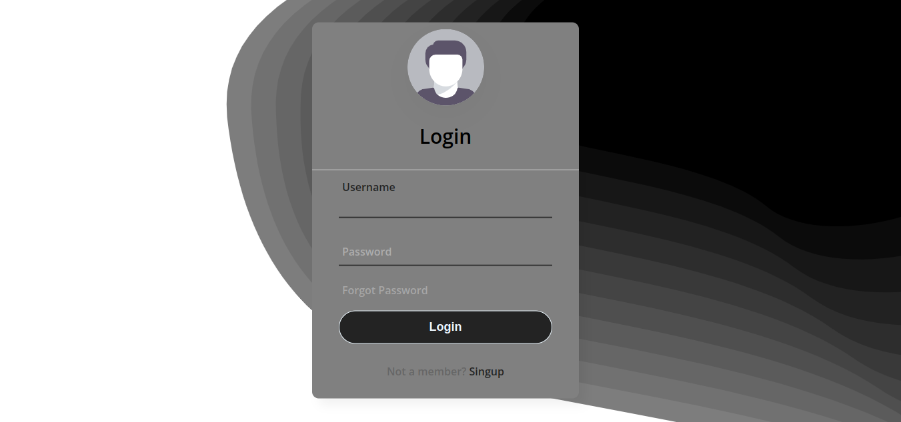

<h1 align="center"> Animated Login Form </h1>

Página formulario de Login animado!

  <a href="#-tecnologias">Tecnologias</a>&nbsp;&nbsp;&nbsp;|&nbsp;&nbsp;&nbsp;
  <a href="#-projeto">Projeto</a>&nbsp;&nbsp;&nbsp;|&nbsp;&nbsp;&nbsp;

 

## 🚀 Tecnologias

Esse projeto foi desenvolvido com as seguintes tecnologias:

- HTML e CSS
- Git e GitHub

## 💻 Projeto

Este projeto foi criado com intenção de praticar as tecnologias HTML e CSS, onde pude explorar efeitos animados de uma maneira minimalista. Apesar de ser um formulário basico, foi interessante treinar posicionamento e estilização dos componentes!

Link do deploy:

---